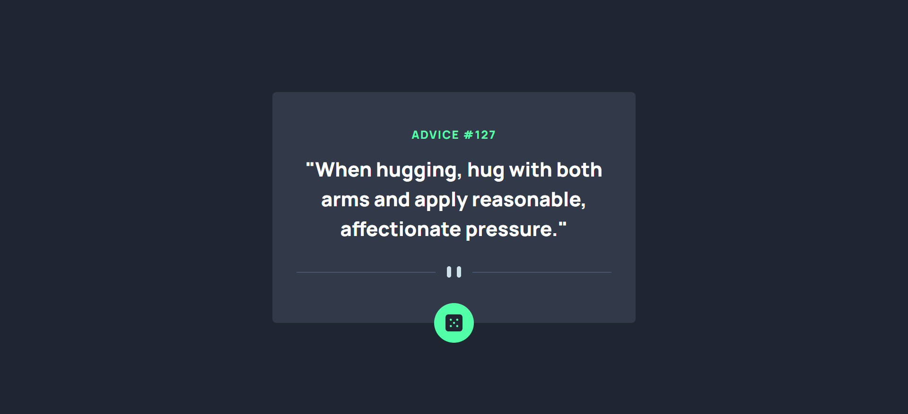

# Frontend Mentor - Advice Generator App Solution

This is a solution to the [Advice generator app challenge on Frontend Mentor](https://www.frontendmentor.io/challenges/advice-generator-app-QdUG-13db). Frontend Mentor challenges help you improve your coding skills by building realistic projects.

## Table of contents

- [Overview](#overview)
  - [The challenge](#the-challenge)
  - [Screenshot](#screenshot)
  - [Links](#links)
- [My process](#my-process)
  - [Built with](#built-with)
  - [What I learned](#what-i-learned)
  - [Continued development](#continued-development)
  - [Useful resources](#useful-resources)
- [Author](#author)
- [Acknowledgments](#acknowledgments)

## Overview

### The challenge

Users should be able to:

- View the optimal layout for the app depending on their device's screen size
- See hover states for all interactive elements on the page
- Generate a new piece of advice by clicking the dice icon

### Screenshot



Add a screenshot of your solution. The easiest way to do this is to use Firefox to view your project, right-click the page and select "Take a Screenshot". You can choose either a full-height screenshot or a cropped one based on how long the page is. If it's very long, it might be best to crop it.

### Links

- Solution URL: [Your solution URL](https://your-solution-url.com)
- Live Site URL: [Your live site URL](https://your-live-site-url.com)

## My process

### Built with

- Semantic HTML5 markup
- CSS custom properties
- Flexbox
- Mobile-first workflow
- [React](https://reactjs.org/) - JS library
- [Vite](https://vitejs.dev/) - Frontend tool
- [Advice Slip API](https://api.adviceslip.com/) - For generating advice

### What I learned

During this project, I deepened my understanding of React's state management and useEffect hook for handling side effects like fetching data from an API. Additionally, I learned how to effectively use Flexbox for responsive design and how to work with Vite for faster development.

Here’s a small snippet of code that I’m particularly proud of:

```js
const handleClick = async () => {
  const response = await fetch('https://api.adviceslip.com/advice');
  const json = await response.json();
  setAdvice(json);
};
```

### Continued development

In future projects, I want to focus more on advanced React concepts, such as context and custom hooks, as well as refining my skills in CSS animations and transitions.

### Useful resources

- [React Documentation](https://reactjs.org/docs/getting-started.html) - The official React documentation helped me understand the fundamentals of React components and hooks.
- [Vite Documentation](https://vitejs.dev/guide/) - This was helpful in understanding how to set up a modern frontend development environment.

## Author

- Frontend Mentor - [@omk1r](https://www.frontendmentor.io/profile/o)mk1r
- Twitter - [@omk1rJ](https://www.twitter.com/omk1rJ)

## Acknowledgments

I would like to thank the Frontend Mentor community for providing such a great platform to practice and improve coding skills. Special thanks to the creators of the Advice Slip API for providing an easy-to-use API for this project.
